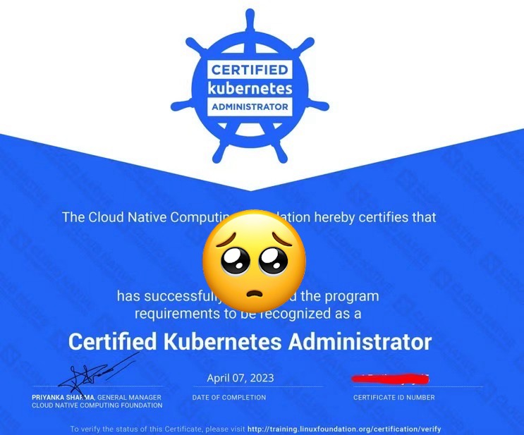
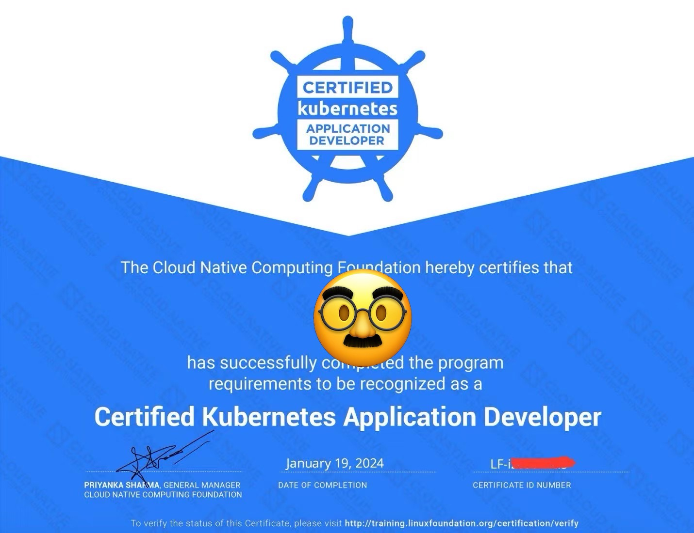
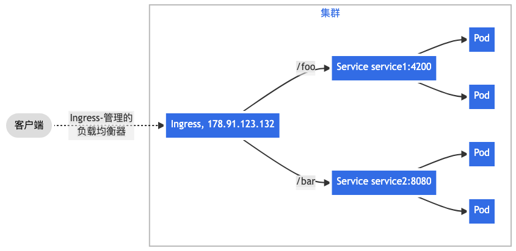
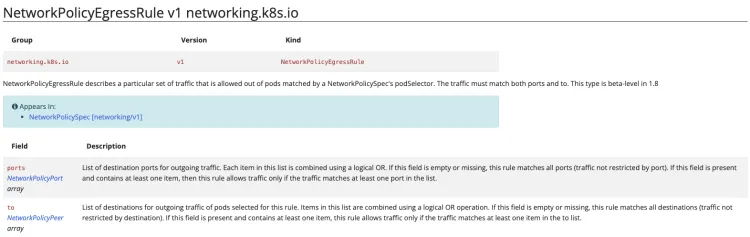
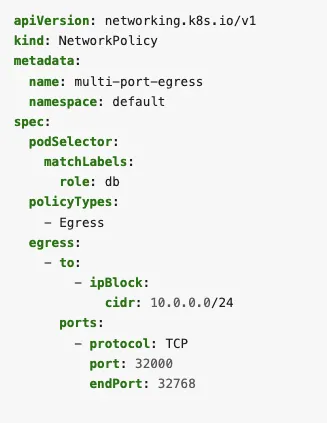

## 成绩：
82分，版本是1.28，考试时间是2024-1-19。所有题目难度都很低，16道题。只要赠送的 killer 两次模拟机会好好利用即可。但为什么还拿低分？
网络原因背大锅！考试开始的二十分钟都在和监考官掰扯网络，还有技术员加入。最后技术员解决方法是 reset desktop，这才有所缓解。
但还是非常卡。所以备考的同学要注意适应，否则心态容易崩。

## CKA 和 CKAD 的认证



## 考试电脑预设
```shell
## -n namespace 提前写
kubectl -n namespace
## create/run deploy/pod/svc 提前写, 明确要创建的是什么类型API 资源, 紧跟着创建的名称
kubectl -n namespace run pod pod1
kubeclt -n namespace create deploy deploy1

## create yaml on-the-fly faster
export do='--dry-run=client -o yaml'
```

## 官网
- kubernetes: https://kubernetes.io/
- helm: https://helm.sh/
- kubectl reference:  官网 --> 参考 --> 命令行工具（kubectl）--> kubectl 命令
- api-reference: 官网 --> 参考 --> API 概述 --> Kubernetes API 参考

## 技巧
### 1. Vim 技巧
   - 撤销 U
   - 反撤销 Ctrl + U
   - 历史命令 history
   - Vim中进行多行缩进，可以按以下步骤操作：
     1. 进入Vim编辑器并进入命令模式。
     2. 使用 v 键或 Shift + v 键选择多行需要缩进的文本。
     3. 按下 > 键进行向右缩进，或按下 < 键进行向左缩进。
     4. 按下 Esc 键退出选择模式。
### 2. kubectl 选择器
> [!NOTE]
> -l, --selector='':   Selector (label query) to filter on, supports '=', '==', and   '!='.(e.g. -l key1=value1,key2=value2). Matching objects must satisfy   all of the specified label constraints.

```shell
# 查询labels有 unhappy: false 的POD
k8s@terminal:~$ kubectl get pod -l unhappy=false
# 查询labels没有 unhappy: false 的POD
k8s@terminal:~$ kubectl get pod -l unhappy!=false
# 查询既有unhappy: false 又有 unhappy: true 的POD
k8s@terminal:~$ kubectl get pod -l "unhappy in (true, false)"
# 给标签中含有unhappy: false 的pod增加新标签
k8s@terminal:~$ kubectl label pod -l unhappy=false happy=true
```
> [!NOTE]
> For your convenience, all environments, in other words, the base system and the cluster nodes, have the following additional command-line tools pre-installed and pre-configured: - kubectl with kalias and Bash autocompletion - jq for YAML/JSON processing - tmux for terminal multiplexing - curl and wget for testing web services - man and man pages for further documentation

### 3.使用临时 pod 测试api
```shell
   ## 通过服务提供对应用程序的访问并排除故障
   k run tmp --restart=Never --rm -i --image=nginx:alpine -- curl 10.0.0.67
```

### 4. 使用secret
   secret 相关文档导航
   - 参考: **任务 --> 给应用注入数据 --> 使用 Secret 安全地分发凭据**，包含secret 作环境变量和卷挂载两种方式.
   - 参考: **概念 --> 配置 --> Secret**, 包含secret 作环境变量和卷挂载两种方式.

### 5. 使用configmap
   configmap 使用的文章可以
   - 参考: **任务 --> 配置 Pod 使用 ConfigMap**, 包含cm 作环境变量和卷挂载两种方式.
   - 参考: **概念 --> 配置 --> ConfigMap**

### 6. PVC PV 同时创建
   - **任务 --> 运行应用 --> 运行一个单实例有状态应用**
### 7. 准入控制器开启关闭
   - **参考 --> API 访问控制 --> 准入控制器**

## Question
### Ingress

#### 例子
> Q1. The Nginx Ingress Controller has been installed.
> Create a new Ingress resource called world for domain name world.universe.mine . The domain points to the K8s Node IP via /etc/hosts .
> The Ingress resource should have two routes pointing to the existing Services:
> http://world.universe.mine:30080/europe/
> and
> http://world.universe.mine:30080/asia/

#### 思路
> [!NOTE] 
> 1. 查看ingressclass, 需要指定使用的class 
> 2. 创建以前缀匹配的ingress 
> 3. 修改yaml以使用Prefix 
> 4. apply it 
> 5. validate it, 使用curl 访问一遍这条ingress（需要记得提前查看ingress 所在的service 端口, 一般为NodePort 类型）

```shell
# 1. 查看ingressclass, 需要指定使用的class
controlplane $ kubectl get ingressclass
NAME    CONTROLLER             PARAMETERS   AGE
nginx   k8s.io/ingress-nginx   <none>       30m

# 2. 创建以前缀匹配的ingress
controlplane $ k -n world create ing world --class=nginx \
--rule="world.universe.mine/europe=europe:80" \
--rule="world.universe.mine/asia=asia:80" \
annotation="nginx.ingress.kubernetes.io/rewrite-target: /" \
-o yaml --dry-run=client > ing.yaml

# 3. 修改以使用Prefix
controlplane $ vim ing.yaml
apiVersion: networking.k8s.io/v1
kind: Ingress
metadata:
creationTimestamp: null
name: world
namespace: world
annotations:
nginx.ingress.kubernetes.io/rewrite-target: /
spec:
ingressClassName: nginx
rules:
- host: world.universe.mine
  http:
  paths:
    - backend:
      service:
      name: europe
      port:
      number: 80
      path: /europe
      pathType: Exact  ### update to Prefix
    - backend:
      service:
      name: asia
      port:
      number: 80
      path: /asia
      pathType: Exact  ### update to Prefix
# 4. 运行
controlplane $ kubectl -n world apply -f ing.yaml
```
### NetworkPolicies
#### 例子
>Q1 There are existing Pods in Namespace space1 and space2 .
>We need a new NetworkPolicy named np that restricts all Pods in Namespace space1 to only have outgoing traffic to Pods in Namespace space2 . Incoming traffic not affected.
>The NetworkPolicy should still allow outgoing DNS traffic on port 53 TCP and UDP.

#### 思路
是比较费时间的题目, 没有kubectl 快捷创建的命令，需要自行copy 官网案例。需要注意的是，官网给出的配置并不对，需要查看API Reference 来辨别类型.
egress的 to 和 ports 均为 array 类型


<p style="text-align: center;">NetworkPolicy API Reference</p>


<p style="text-align: center;">官网案例（有误）</p>

```yaml
apiVersion: networking.k8s.io/v1
kind: NetworkPolicy
metadata:
  name: np
  namespace: space1
spec:
  policyTypes:
  - Egress
  egress:
  - to:
    - namespaceSelector:
        matchLabels:
          kubernetes.io/metadata.name: space2

  - ports:
    - protocol: TCP
      port: 53
    - protocol: UDP
    - port: 53
```

```shell
## verify 部分还需要再留心

# these should work
k -n space1 exec app1-0 -- curl -m 1 microservice1.space2.svc.cluster.local
k -n space1 exec app1-0 -- curl -m 1 microservice2.space2.svc.cluster.local
k -n space1 exec app1-0 -- nslookup tester.default.svc.cluster.local
k -n space1 exec app1-0 -- nslookup killercoda.com

# these should not work
k -n space1 exec app1-0 -- curl -m 1 tester.default.svc.cluster.local
k -n space1 exec app1-0 -- curl -m 1 killercoda.com
```

### Admission Controllers
CKAD 独占题, 需要注意的是
>这两个配置是专门用于开启或关闭admission controllers 使用
> --enable-admission-plugins=NamespaceLifecycle,LimitRanger
> --disable-admission-plugins=PodNodeSelector
### 自建 CRD 資源
CKAD 独占题, 需要注意的是
```yaml
apiVersion: apiextensions.k8s.io/v1
kind: CustomResourceDefinition
metadata:
  name: shopping-items.beta.killercoda.com
spec:
  group: beta.killercoda.com
  versions:
    - name: v1
      served: true
      storage: true
      schema:
        openAPIV3Schema:
          type: object
          properties:
            spec:
              type: object
              properties:
                description:
                  type: string
                dueDate:
                  type: string
  scope: Namespaced
  names:
    plural: shopping-items
    singular: shopping-item
    kind: ShoppingItem
```
CRD 特点
1. 通过kubectl apply -f 创建出这个crd. 那么即可通过kubectl get crds 找到它
2. plural 是使用client 的复数名， singular 是使用client 的别名.
3. 如果以此CRD 来创建resource, yaml 如下
```yaml
apiVersion: "beta.killercoda.com/v1"
kind: ShoppingItem
metadata:
  name: bananas
spec:
  dueDate: tomorrow
  description: buy yellow ones
```

注意：
区分 CRD 和 使用CRD 创建出来的资源. 相当于面向对象编程中的 类 和 对象.

### Rollout Green-Blue
CKAD 独占题
1. 创建新的deployment, 但拥有不同的标签
2. 使用service 切换绑定的POD 标签 
3. 测试OK后，再scale down

### Rollout Canary
CKAD 独占题，省略。
